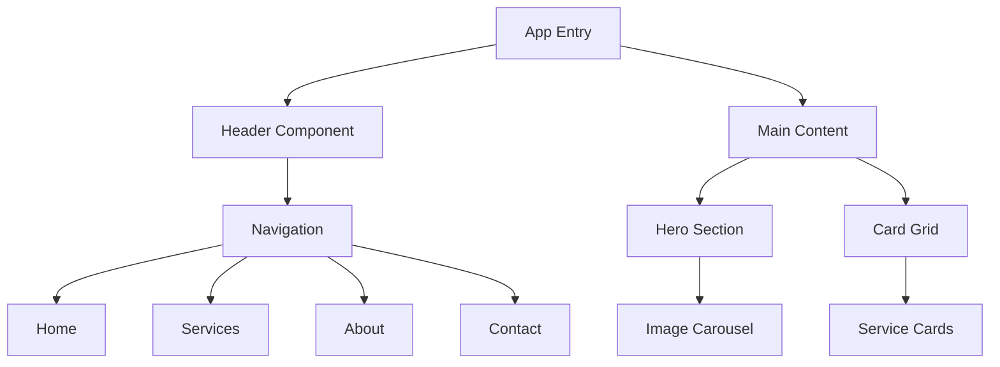
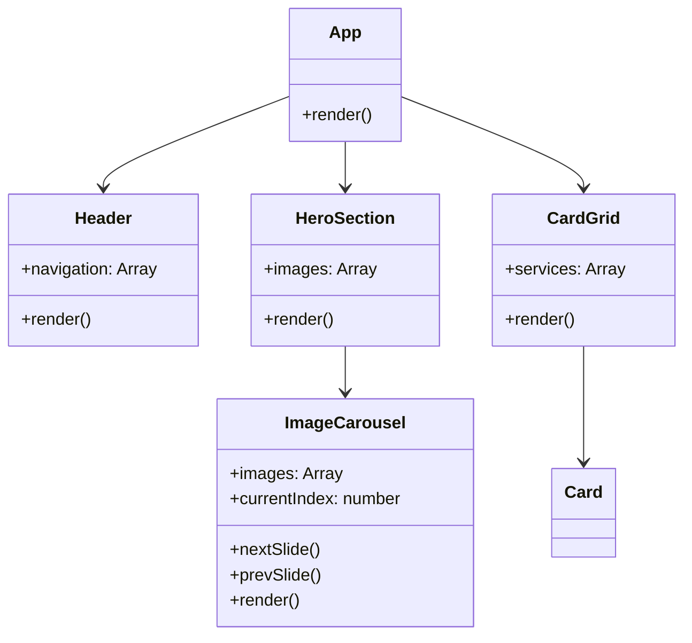

# ProVital - Modern Healthcare Solutions 🏥

<div align="center">
  
  
  
  
</div>

## 📋 Table of Contents
- [Overview](#overview)
- [Features](#features)
- [Tech Stack](#tech-stack)
- [Project Structure](#project-structure)
- [Getting Started](#getting-started)
- [Application Flow](#application-flow)
- [Contributing](#contributing)

## 🌟 Overview
ProVital is a modern, responsive healthcare solutions platform built with React. It provides an intuitive interface for healthcare services, featuring a dynamic hero section, interactive card grid, and seamless navigation.

## ✨ Features
- 🎨 Modern and responsive design
- 📱 Mobile-first approach
- 🖼️ Dynamic image carousel
- 🎯 Interactive service cards
- 🗺️ Intuitive navigation
- 💨 Fast loading times

## 🛠️ Tech Stack

<div align="center">

[](https://skillicons.dev)

</div>

| Technology | Version | Purpose |
|------------|---------|----------|
| React | 19.1.0 | Frontend framework |
| React Router | 7.6.2 | Navigation |
| SASS | 1.89.2 | Styling |
| Font Awesome | 6.7.2 | Icons |

## 📁 Project Structure

```
frontend/
├── public/
│   ├── images/
│   │   ├── hero/
│   │   └── services/
│   └── index.html
└── src/
    ├── components/
    │   ├── CardGrid/
    │   ├── Header/
    │   ├── HeroSection/
    │   └── ImageCarousel/
    ├── App.js
    └── index.js
```

## 🚀 Getting Started

1. **Clone the repository**
   ```bash
   git clone https://github.com/yourusername/ProVital.git
   ```

2. **Install dependencies**
   ```bash
   cd frontend
   npm install
   ```

3. **Start the development server**
   ```bash
   npm start
   ```
   The application will be available at `http://localhost:3000`

## 🔄 Application Flow



## Component Architecture


## 🤝 Contributing

1. Fork the repository
2. Create your feature branch (`git checkout -b feature/AmazingFeature`)
3. Commit your changes (`git commit -m 'Add some AmazingFeature'`)
4. Push to the branch (`git push origin feature/AmazingFeature`)
5. Open a Pull Request

## 📄 License

This project is licensed under the MIT License - see the [LICENSE](LICENSE) file for details.
